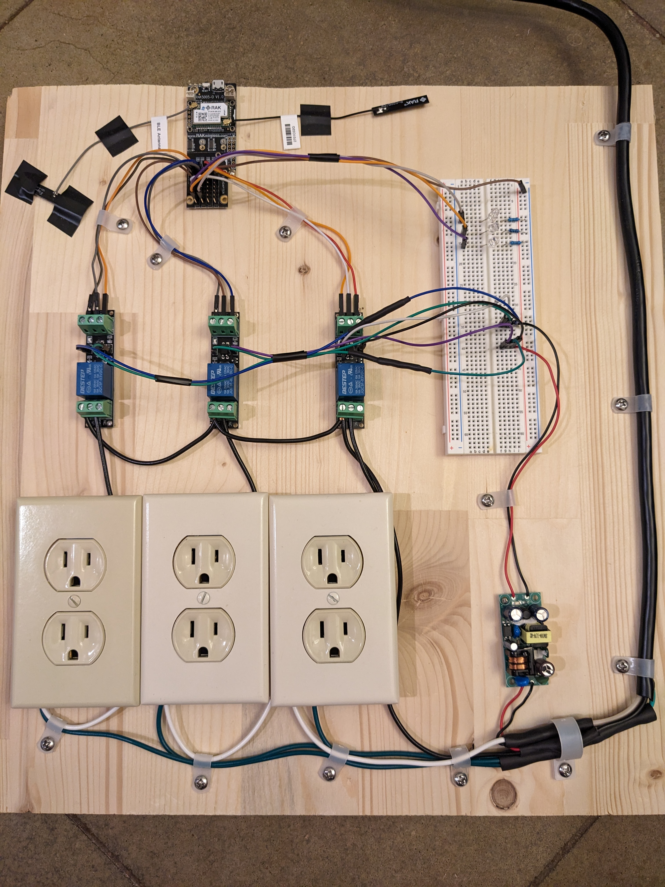
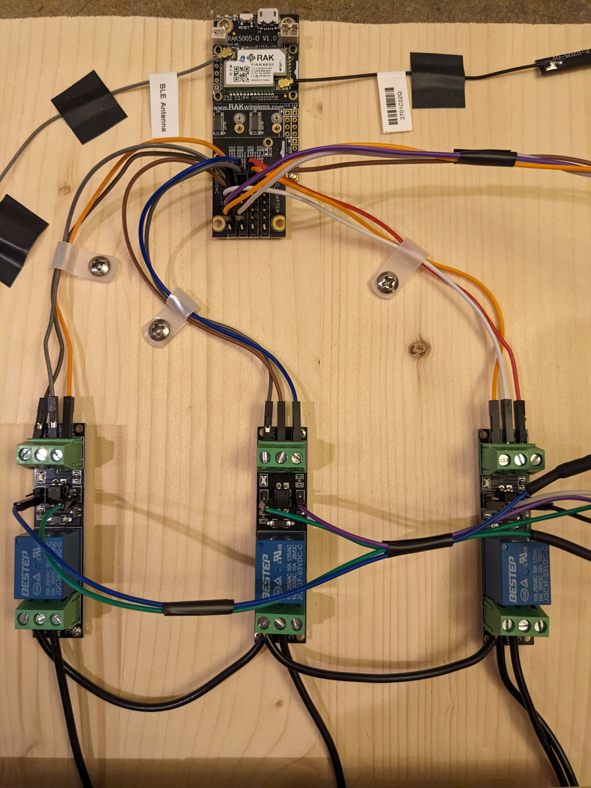

# Helium_LoRa_Outlet_Control
Docs 2-22-23 V1 (For questions or comments:  Stephen Witty switty@level500.com)  

### Project Overview:
The Helium LoRa Multi-Outlet control project is designed to automate the control of three AC outlets from the Helium LoRa network.  The project allows the independent and or concurrent control of three AC electrical outlets.  The project could be extended to additional outlets or reduced.  Downlink commands from the Helium LoRa network indicate what outlets to turn on and the duration.

The project should be considered demo quality only.

Note - this project contains AC components, these can kill you, use caution.  Do not attempt without knowledge of AC circuits and dangers.

Known bugs: Project source code likely does not handle millis() rollover at 49 days of continuous operation.  This should be investigated before running beyond this time without a MCU reset.

### Many thanks:
- The Mycelium Networks Builder Program for support and encouragement
- RAK Wisblock for excellent hardware offerings and code examples

 &nbsp; &nbsp;  &nbsp; &nbsp; &nbsp; &nbsp; &nbsp; &nbsp; &nbsp; &nbsp;

### Demo Link:

https://www.youtube.com/watch?v=C5F2tkX1Cis
### Hardware:
- RAK4631 - MCU
- RAK5005-O - Baseboard
- Three LEDs and three 1K resistors
- Three 3V relay Power Switch Boards - Module Opto Isolation High-Level Trigger for IOT
- HiLetgo AC-DC 220V to 3.3V Isolated Switching Power Supply Module Board

### Project files:
- Documentation - ReadMe.cmd
- Primary Source Code - MultiOutlet.ino
- Header file - keys.h (Contains Helium user application keys)

### Circuit:
- WB_IO1 - Relay 1 operation on/off - to relay 1
- WB_IO3 - Relay 2 operation on/off - to relay 2
- WB_IO4 - Relay 3 operation on/off - to relay 3
- WB_IO5 - Helium Receive packet, connected to Blue LED with resistor to ground
- WB_IO6 - ERROR, connected to Red LED with a resistor to ground
- LED1 on RAK5005-0 connected to Green LED with a resistor to ground
- Relay1,2, and 3 - connected to control AC outlets
- HiLetgo power supply connected to drive relay switching power source

- Power to the MCU is supplied by any USB source.
- Power to the AC outlets is supplied by an AC source 

### Operation:
When powered on, the device attempts to connect to Helium LoRa.  Status is provided via LEDs and documented below.  If a successful LoRa connection is made, the three outlets can be controlled via downlink commands.

Downlink commands take the form of a text command which can be sent via the Helium console manual downlink panel, any port, selecting text format.

### Command format:

“Outlet #” “Seconds on” “Outlet #” “Seconds on” “Outlet #” “Seconds on”

Example:  To run the first outlet 15 seconds, the second outlet 30 seconds and the third outlet 20 seconds the command would be

1 15 2 30 3 20

The outlets can also perform an automated test pattern if the text - stress test is downlinked.  This is the test being performed in the demo video.

### LED meaning:
- Blue IO5 - Helium receive packet
- Red IO6 - Blinking alone, no LoRa connection, or command error
- Green RAK5005-O LED1 - Helium send packet
- Orange LED built on board - on means power is supplied to MCU
- LEDs blink concurrently while attempting to connect to the Helium LoRa network

### Misc:
Since Helium LoRa is Class A only at the time of this writing, a downlink command can only occur after a Helium uplink.  Uplinks occur every 20 seconds in the current source code, making downlink commands take up to 20 seconds to occur or longer if a downlink is missed.

Known bugs: Project source code likely does not handle millis() rollover at 49 days of continuous operation.  This should be investigated before running beyond this time without a MCU reset.

The project should be considered demo quality only.

Currently, the MCU is powered by USB, but could be powered by the same voltage regulator supplying power to the relays.
